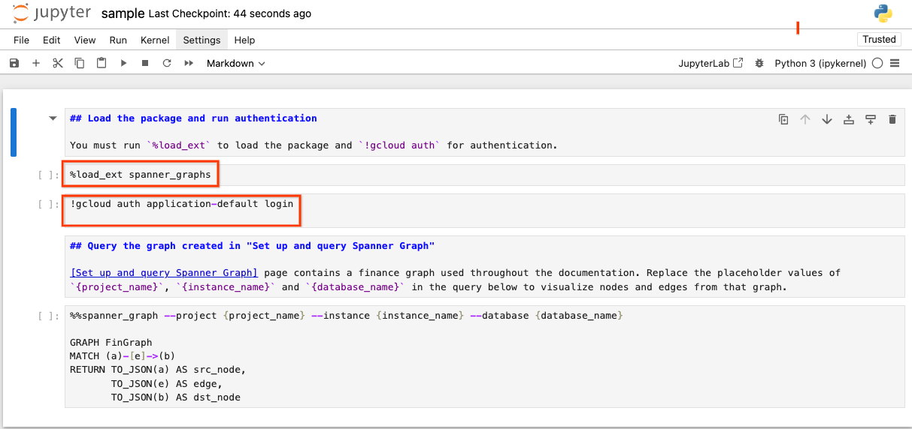
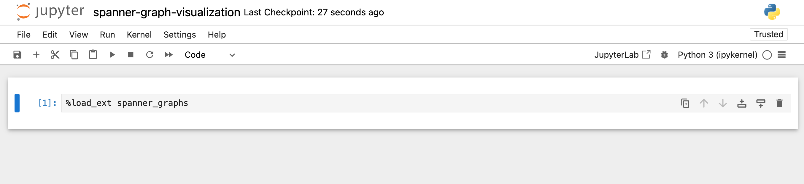
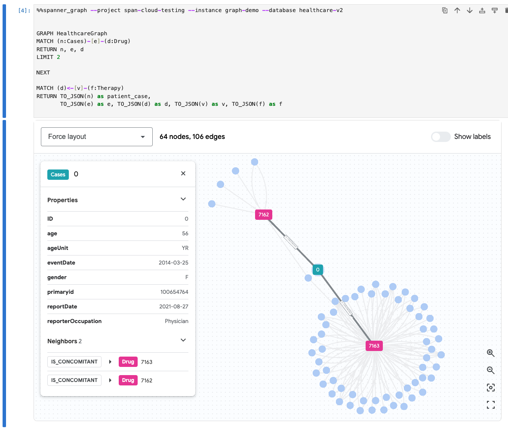
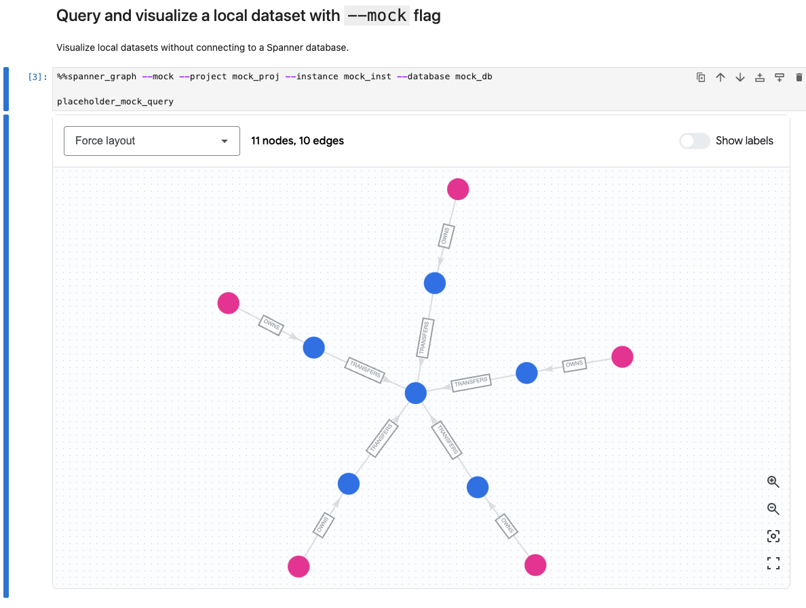

# Spanner Graph Notebook

This tool allows you to query [Spanner Graph](https://cloud.google.com/spanner/docs/graph/overview) in a notebook environment, visualize query results and the graph schema.


## Install dependencies

All dependencies below must be installed before using the tool.

### Install the gcloud CLI

`gcloud` CLI is needed to use the tool. Follow the installation [manual](https://cloud.google.com/sdk/docs/install) to install.

### Install dependencies

Python dependencies should ideally be installed in a managed Python environment using tools like `conda` or `virtualenv`.

When in the root directory of the package, follow the command below to install dependencies in `setup.py`.

```shell
pip install .
```

## Using

### Launch notebook and follow steps in `sample.ipynb`

When in the root directory of the package, run `jupyter notebook` to launch Jupyter Notebook.

```shell
jupyter notebook
```

As Jupyter local server runs, it will open up a web portal. You can open open the `sample.ipynb` to step through an example.


You must run `%load_ext spanner_graphs` to load this package and and `!gcloud auth` for authentication before querying your Spanner database.






### Query and visualize a local dataset with `--mock` flag

`%%spanner_graph` is the magic command to visualize Spanner Graph query result in the notebook environment. 

Using the `--mock` flag, you can visualize local graph datasets without needing to connect to a live Cloud Spanner database.

Insert a code cell and run the command below. It renders a network of `person` and `account` nodes, along with edges in between.

```
%%spanner_graph --mock --project mock_proj --instance mock_inst --database mock_db

mock_query
```


### Visualize graph queries from your Spanner Graph database

#### Authentication

To connect to your Spanner database, you need to first authenticate via `gcloud auth`. Copy the command below in a new code cell, and run it. This opens a new browser tab for the Google Cloud authentication process.

```shell
!gcloud auth application-default login
```


#### Query and visualize Spanner Graph data

Using the `%%spanner_graph` magic command, you can visualize graph query results. 

The magic command needs to be used with your GCP resource info and a query string:
 - a GCP project id for `--project` option
 - a Spanner instance id for `--instance` option
 - a Spanner Graph database id for `--database` option
 - a [GQL](https://cloud.google.com/spanner/docs/graph/queries-overview) query string



### Query and visualize a local dataset with `--mock` flag

Using the `--mock` flag for `%%spanner_graph`, you can visualize local graph datasets without needing to connect to a live Cloud Spanner database. The mock
datasets render a network of `person` and `account` nodes, along with edges in between.

```
%%spanner_graph --mock --project mock_proj --instance mock_inst --database mock_db

mock_query
```




## Query Requirements

### Use `TO_JSON` function to return graph elements

Graph queries **must use** `TO_JSON` function in the `RETURN` statement to visualize
nodes and edges.

```sql
👍 Good example returning nodes and edges as JSON.


GRAPH FinGraph
MATCH (person:Person {id: 5})-[owns:Owns]->(accnt:Account)
RETURN TO_JSON(person) AS person,
       TO_JSON(owns) AS owns,
       TO_JSON(accnt) AS accnt;
```

```
👎 Anti-example returning nodes properties rather than JSON format.

GRAPH FinGraph
MATCH (person:Person {id: 5})-[owns:Owns]->(accnt:Account)
RETURN person.id AS person,
       owns.amount AS owns,
       accnt.id AS accnt;
```

### Identify nodes and edges to be visualized

You must return all nodes and edges in order for them to be visualized. Nodes and edges matched in queries but not returned will not be visualized.

```
👍 Good example returning all nodes and edges to be visualized.

GRAPH FinGraph
MATCH (person:Person {id: 5})-[owns:Owns]->(accnt:Account)-[transfer:Transfers]-(another_accnt:Account)
RETURN TO_JSON(person) AS person,
       TO_JSON(owns) AS owns,
       TO_JSON(accnt) AS accnt,
       TO_JSON(transfer) AS transfers,
       TO_JSON(another_accnt) AS accnt_2;
```

```
👎 Anti-example returning only nodes but no edges. The visualization will only render nodes.

GRAPH FinGraph
MATCH (person:Person {id: 5})-[owns:Owns]->(accnt:Account)-[transfer:Transfers]-(another_accnt:Account)
RETURN TO_JSON(person) AS person,
       TO_JSON(accnt) AS accnt,
       TO_JSON(another_accnt) AS accnt_2;
```

### Visualize multiple-hop queries

If you want to visualize all intermediate nodes' labels and properties in a
quantified edge pattern, you can capture source and destination of edge with a name
in a parentheses in the following way `((edge_src)-[edge]->(edge_dst)){1,3}`.

```
👍 Good example capturing edges' source and destination nodes.
GRAPH FinGraph
MATCH (src:Account)((edge_src)-[edge]->(edge_dst)){1,2}(dst:Account)
WHERE src.id = 8
RETURN TO_JSON(edge_src) as acc,
       TO_JSON(edge) as trans,
       TO_JSON(edge_dst) AS edge_dst;
```

```
👎 Anti-example failing to capture, hence some intermediate nodes will be displayed
in grey color without label and property information.

GRAPH FinGraph
MATCH (src:Account)-[edge]->{1,2}(dst:Account)
WHERE src.id = 8
RETURN TO_JSON(src) as acc,
       TO_JSON(edge) as trans,
       TO_JSON(dst) AS edge_dst;
```

## Testing changes

After adding new changes, please run unit and integration tests with the command below:


```shell
cd spanner_graphs && python -m unittest discover -s tests -p "*_test.py"
```
